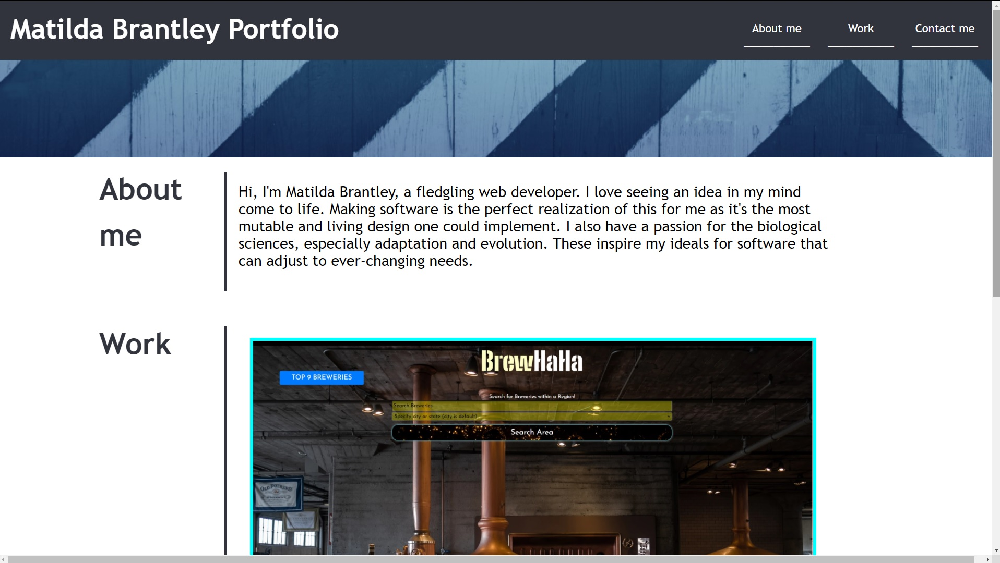
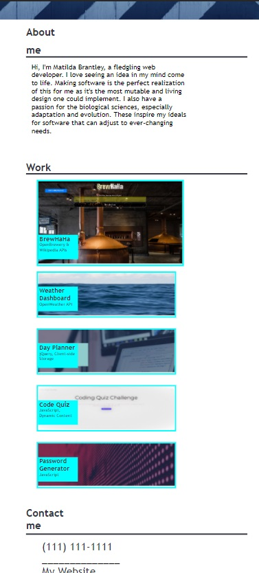

# Portfolio Website

### Matilda Brantley
[Live GitHub Portfolio](https://matildabrantley.github.io/portfolio/)

## Features
* Links to live GitHub website for each project.
* Link to my main GitHub account.
* Responsive interface.
* Most recent project stands out.
* Layout is completely mobile-friendly (screenshot below).

## Challenging Aspects of Project
* Positioning all the elements to match the mock-up was difficult.
* Maintaining relative positions when window is rescaled proved difficult.
* Felt like I needed to create divs too often.
* Re-using card classes in most recent project card (due to larger display)

## Reworks
* Incorporated many elements into reusable classes, such as major-section, section-title, card-title
* Switched to CSS Grid to quickly rearrange major elements when needed

## Screenshots

Larger Device Layout:

Mobile Device Layout:

## Goals for Portfolio Homework

Given I need to sample a potential employee's previous work
* When I load their portfolio
    * Then I am presented with the developer's name, a recent photo or avatar, and links to sections about them, their work, and how to contact them
* When I click one of the links in the navigation
    * Then the UI scrolls to the corresponding section
* When I click on the link to the section about their work
    * Then the UI scrolls to a section with titled images of the developer's applications
* When I am presented with the developer's first application
    * Then that application's image should be larger in size than the others
* When I click on the images of the applications
    * Then I am taken to that deployed application
* When I resize the page or view the site on various screens and devices
    * Then I am presented with a responsive layout that adapts to my viewport